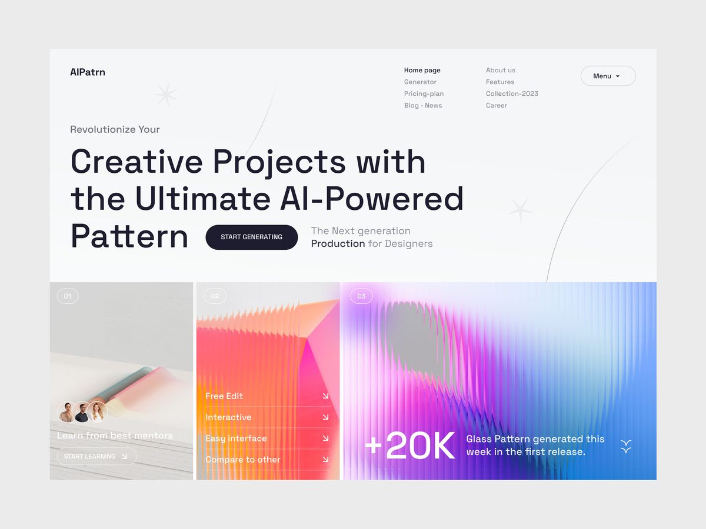

# VocalBeam - AI Automation Agency

A modern, high-performance landing page built with Next.js 15, TypeScript, Tailwind CSS v4, and animated components.



## Features

- **Hero Section** with typing animation and Hormozi-style value proposition
- **Product Carousel** - Mobile-optimized swipeable cards showcasing AI solutions
- **Interactive Roadmap** - Scroll-activated timeline with 5-week process
- **Founder Video Section** - Embedded YouTube video with glassmorphism design
- **Contact Section** - Calendly integration only (no forms)
- **Custom Animations** - Framer Motion with smooth transitions
- **MagicUI Components** - Animated grid pattern and typing effects
- **Glassmorphism Design** - Modern transparent UI elements
- **Custom Cursor** - Black/white theme-adaptive cursor
- **Fully Responsive** - Mobile-first design with horizontal scrolling
- **Type-safe** - Full TypeScript coverage
- **Performance Optimized** - Next.js Image optimization and code splitting

## Quick Start

### Prerequisites

- Node.js 18+
- npm or yarn

### Installation

```bash
# Install dependencies
npm install

# Run development server
npm run dev
```

Open [http://localhost:3000](http://localhost:3000) in your browser.

### Build for Production

```bash
npm run build
npm start
```

## Configuration

### 1. Update Calendly URL

Edit `lib/constants.ts`:

```typescript
export const SITE_CONFIG = {
  name: "VocalBeam",
  calendlyUrl: "https://calendly.com/stazizovs/vocalbeam-demo-call", // Update with your Calendly URL
}
```

### 2. Update YouTube Video

Edit `components/sections/founder-video-clean.tsx`:

```typescript
src="https://www.youtube.com/embed/YOUR_VIDEO_ID?start=8"
```

### 3. Update Products & Roadmap

Edit the `PRODUCTS` array in `components/sections/hero-products-roadmap-v2.tsx`:

```typescript
{
  id: "calls",
  title: "AI Call Agents",
  image: "/images/3.png",
  icon: Phone,
  features: ["24/7 Availability", "Natural Conversations", ...],
  steps: [
    { title: "Discovery", detail: "..." },
    // 5 steps for your process
  ],
}
```

### 4. Update Hero Copy

Edit the typing phrases in `components/sections/hero-products-roadmap-v2.tsx`:

```typescript
const typingPhrases = [
  "Missed Calls",
  "Slow Response Time",
  "Manual Data Entry",
  // Add your pain points
]
```

## Project Structure

```
speech0land/
├── app/                           # Next.js 15 app directory
│   ├── page.tsx                  # Main landing page
│   ├── layout.tsx                # Root layout with theme provider
│   └── globals.css               # Global styles, scrollbar, cursor
├── components/
│   ├── sections/                 # Page sections
│   │   ├── hero-products-roadmap-v2.tsx  # Hero + Products + Roadmap
│   │   ├── founder-video-clean.tsx       # YouTube video embed
│   │   └── contact-calendly.tsx          # Calendly integration
│   ├── magicui/                  # MagicUI components
│   │   ├── animated-grid-pattern.tsx     # Background animation
│   │   └── cursor-trail.tsx              # Custom cursor
│   ├── ui/                       # shadcn/ui components
│   │   ├── carousel.tsx          # Product carousel
│   │   └── typing-animation.tsx  # Hero typing effect
│   └── navigation.tsx            # Site header
├── lib/
│   ├── constants.ts              # Site configuration
│   └── utils.ts                  # Utility functions
├── public/images/                # Product images (1.png, 3.png, 4.png)
├── deploy.sh                     # Production deployment script
└── README.md                     # This file
```

## Tech Stack

- **Framework**: Next.js 15 (App Router)
- **Language**: TypeScript 5
- **Styling**: Tailwind CSS v4
- **UI Components**: shadcn/ui + MagicUI
- **Animations**: Framer Motion 12
- **Icons**: Lucide React
- **Scheduling**: Calendly Widget (no React wrapper)
- **Theme**: next-themes (light/dark mode)

## Deployment

### Deploy to vocalbeam.com (Production)

This site is deployed on a VPS with nginx and systemd. To deploy:

```bash
# 1. Build the application
npm run build

# 2. Run deployment script
./deploy.sh
```

The deployment script will:
- ✅ Build the Next.js application
- ✅ Configure nginx reverse proxy
- ✅ Setup SSL certificate with Let's Encrypt
- ✅ Create systemd service for auto-restart
- ✅ Start the application on port 3001

**Manual deployment steps:**

```bash
# Copy nginx config
sudo cp /tmp/vocalbeam.com.conf /etc/nginx/sites-available/
sudo ln -s /etc/nginx/sites-available/vocalbeam.com.conf /etc/nginx/sites-enabled/

# Setup SSL
sudo certbot --nginx -d vocalbeam.com -d www.vocalbeam.com

# Setup systemd service
sudo cp /tmp/vocalbeam.service /etc/systemd/system/
sudo systemctl daemon-reload
sudo systemctl enable vocalbeam
sudo systemctl start vocalbeam

# Reload nginx
sudo nginx -t
sudo systemctl reload nginx
```

**Useful commands:**

```bash
# Check application logs
sudo journalctl -u vocalbeam -f

# Restart application
sudo systemctl restart vocalbeam

# Check nginx status
sudo systemctl status nginx

# Test nginx config
sudo nginx -t
```

### Deploy to Vercel (Alternative)

[](https://vercel.com/new)

1. Push your code to GitHub
2. Import repository on Vercel
3. Deploy automatically

## Key Design Decisions

- **Mobile-first**: Product cards use horizontal carousel on mobile for better UX
- **Glassmorphism**: Transparent backgrounds with backdrop-blur throughout
- **No forms**: Only Calendly integration for lead capture
- **Scroll animations**: Roadmap activates steps based on scroll position
- **Auto-carousel**: Product cards auto-scroll every 3 seconds on mobile
- **Typing animation**: Hero headline cycles through pain points every 4 seconds
- **Theme support**: Full light/dark mode with custom scrollbar and cursor

## Documentation

For detailed conversation history and implementation details, see [claude.md](claude.md).

## Support

For questions or support: admin@vocalbeam.com

## License

© 2025 VocalBeam. All rights reserved.
